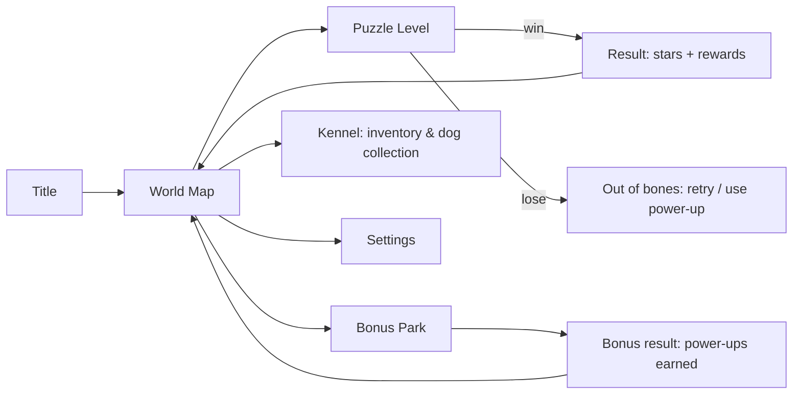

# 02 — Core Game Design: Woofdoku

## Rules (shown to the player)
> 🐕 Place one dog in every **row**, every **column** and every **colored yard**.
> 🚫 Dogs need space: no two dogs may touch — **not even diagonally**.

Board: N×N, N colored regions ("yards"), exactly N dogs. Unique, logically solvable solution.

## Cell states
| State | Visual | Set by |
|---|---|---|
| Empty | plain colored tile | default |
| X (manual) | small paw-print ✕ | player |
| X (auto) | lighter/fainter ✕ | auto-cross helper / power-ups |
| Dog (locked) | dog sprite of the region's breed | correct placement |
| Wrong dog (transient) | shaking red dog → disappears | wrong placement (costs a bone) |

## Controls
| Platform | X toggle | Place dog | Paint X |
|---|---|---|---|
| Touch | tap | double-tap **or** long-press | drag |
| Mouse | left click | double-click **or** right-click | click-drag |
| Keyboard | arrows to move, `Space` = X | `Enter` = dog | `Shift`+arrows |

- Drag mode is decided by the first cell: if it was empty → paint X; if it had X → erase X.
- Setting: **"Placement mode" toggle button** (X-mode / Dog-mode) for players who dislike double-tap.
- **Undo** for X's (unlimited, free). Dogs are locked and cannot be undone (like original).

## Validation
- A dog placement is compared to the stored **solution**.
  - Correct → dog locks, celebration micro-animation, optional auto-cross.
  - Wrong → lose 1 bone 🦴, dog shakes & leaves, the cell becomes an auto X.
- Level is won when all N dogs are placed.
- Level is lost at 0 bones → "Try again" (free restart) or use a power-up (e.g. Extra Bone) to continue.

## Lives
- 3 bones per level (refills every level; **no** global energy/timer system — keep it friendly).

## Helpers (settings, default ON for early levels)
- **Auto-cross**: after placing a dog, auto-X its row, column, region and 8 neighbors.
- **Conflict highlight**: highlight rows/cols/regions that are already satisfied.
- **Error checker for X's**: off by default (it would spoil the puzzle).

## Scoring / stars
| Stars | Condition |
|---|---|
| ⭐⭐⭐ | no mistakes, no power-ups used |
| ⭐⭐ | ≤1 mistake **or** ≤1 power-up |
| ⭐ | completed |

Also tracked: completion time (shown, never required), personal best.
Stars unlock chapter gates (see doc 05) and give treat rewards (doc 04).

## Free hint
- One **free "Nudge"** per level: highlights the *area* (row/col/region) where a logical deduction exists, without revealing the cell. Stronger help = power-ups.
- Hint engine uses the logical solver (doc 06) to find the easiest next deduction and can explain it in plain text: *"The blue yard only fits in row 3, so the rest of row 3 can't have a dog."*

## Screens & flow

## In-level HUD
- Top: level number, bones (3 🦴), timer (small, optional), pause.
- Board center, square, responsive.
- Bottom: power-up tray (up to 4 slots), Undo, Nudge, placement-mode toggle.

## Tutorial (levels 1–3)
1. 4×4 board, guided: "This yard has one tile — a dog must live here."
2. Teaches no-touch rule and auto-cross.
3. Teaches X marking and drag.
Then a tooltip introduces power-ups right after the first Bonus Park (level 5).

## Nice-to-haves (later)
- **Daily puzzle** with a streak.
- **Endless mode** using the runtime generator.
- Dog reactions: dogs in adjacent yards "bark" when you hover a conflicting cell.
