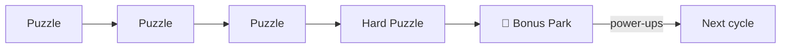

# 05 — Level Progression

## Structure
- **Worlds** of 25 levels each = 20 puzzle levels + 5 Bonus Parks (every 5th level).
- Map screen: a winding walking path through a themed neighborhood; bonus levels drawn as parks/playgrounds.
- **Launch target: 4 worlds = 100 levels** (80 puzzles + 20 bonus). More worlds can be generated later.

| World | Theme | Board sizes | Levels |
|---|---|---|---|
| 1 | 🏡 Backyard | 4×4 → 6×6 | 1–25 |
| 2 | 🌳 City Park | 6×6 → 7×7 | 26–50 |
| 3 | 🏖️ Dog Beach | 7×7 → 8×8 | 51–75 |
| 4 | 🏔️ Mountain Trail | 8×8 → 9×9 (+ a few 10×10) | 76–100 |
| 5+ | ❄️ Snowy Village, 🌃 Night City… | 9×9 → 11×11 | later |

## Difficulty curve
Difficulty = board size + hardest technique required (doc 01) + number of hard steps.

Within each 5-level cycle:
```
L1 easy-ish → L2 medium → L3 medium → L4 hard ("boss") → L5 BONUS (breather + reward)
```
The player spends a power-up on the hard L4, then refills at the bonus. That's the core loop.



### Technique unlock by world
| World | Max technique allowed |
|---|---|
| 1 | Singles, last-cell, neighbor elimination |
| 2 | + region/line confinement |
| 3 | + touch-all elimination, 2-region pigeonhole |
| 4 | + 3+ pigeonhole, 1-step contradiction |

## Unlocking
- Levels unlock linearly (beat level n → n+1 opens).
- **World gates:** soft — finishing the world always unlocks the next; stars only affect the world-chest reward (see open questions).
- Replay any completed level anytime for better stars.

## Bonus tiers
`bonusTier = level / 5` (1, 2, 3, …) → mini-game difficulty parameter (grid size, target, piece count). Each mini-game maps tier → config in its own table.

## After the last world: extra levels
Once every world is cleared, play never stops. There are no more worlds, but levels keep counting up (126, 127, …):
- The Title button turns into **Keep playing · Level N**. The map shows an **🏆 All worlds complete!** card under the last world, with the same button.
- Extra puzzle levels are generated on the fly (off the main thread) from a seed derived from the level id. A level is always the same puzzle, so replays and saved in-progress boards stay valid. They follow the last world's rhythm: easy 9×9, then medium and hard 10×10 (`extraPuzzleSpec` in `levels.ts`).
- Every 5th extra level is still a 🎁 Bonus Park with full rewards. The mini-game rotation simply continues, and the tier is capped at the final world's (`MAX_BONUS_TIER`).
- Extra levels use the last world's look. They don't count towards world chests, the "Levels cleared" total, or the Star Gazer badge. Stats shows a separate "Extra levels" count.

## Level data
```json
{
  "id": 17,
  "size": 6,
  "regions": "AABBCCAABBCC...",
  "solution": [1, 3, 5, 0, 2, 4],
  "difficulty": { "score": 42, "maxTechnique": "regionConfinement" },
  "breeds": ["corgi", "husky"]
}
```
- `regions`: N×N characters, region letter per cell (row-major).
- `solution`: column of the dog for each row.

Bonus levels: `{ "id": 20, "type": "bonus", "game": "blockDrop", "tier": 4, "seed": 12345 }`.
