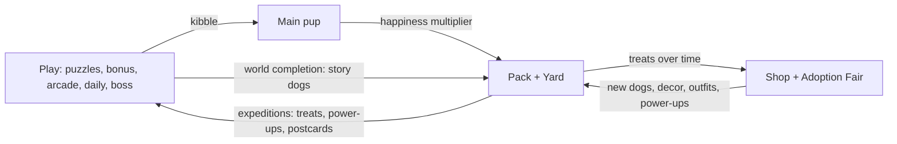

# 10 — Meta Roadmap: Pup, Pack & Yard

> **Status:** design agreed, nothing built yet. Follows on from [08-roadmap.md](08-roadmap.md) (phases 0–6 are done).
> Build the phases in order. Each phase ends with something playable and keeps old saves working.

## Why

The core loop works, but treats and progress don't lead anywhere you care about, and after 100 levels only the Daily streak gives you a reason to return. This roadmap adds a **long-term backbone**: one main pup you care for, plus a growing pack and yard around it.

**Audience:** you, friends and family. Cozy on the surface, with real depth, challenge and some grind underneath.

## Agreed design pillars

| Area | Decision |
|---|---|
| Backbone | One **main pup** plus a growing **pack** and **yard** |
| Neglect | **Medium cost**: when the pup is hungry, its boost stops, yard production slows down and streaks can break. Nothing is ever lost for good (no dogs run away, no items lost) |
| Kibble 🥣 | Earned by **playing** (puzzles, bonus parks, Arcade, Daily, Endless, boss). Only spent on feeding the main pup |
| Treats 🍖 | Produced **over time by the pack**. Spent in the Shop (power-ups, decor, outfits) and the Adoption Fair |
| Pup → pack link | A happy, well-fed pup **multiplies yard treat production** |
| Getting dogs | **Story dogs** (guaranteed per world) plus the **Adoption Fair** (treat-powered gacha with rarities; duplicates upgrade dogs) |
| Pack activity | Dogs passively produce treats (by rarity and level), can be upgraded, and can go on **expeditions** for extra treats or random loot (power-ups, postcards) |
| Luck | **Only** the Adoption Fair. No wheels, scratch cards or claw machines |
| Puzzles | More classic levels **plus** optional twist challenge levels/modes |
| Mini-games | Keep the 10. Add an **Arcade** to replay favorites for kibble and personal bests |
| Challenge | **Achievements/badges** (including tough ones) and a **weekly boss puzzle** |
| Cosmetics | **Yard decor** and **pup outfits**. Looks only, no stat effects |
| Keepsakes | **Postcard album** (from expeditions) and **yard photo mode** (export an image) |
| Social | Single-player for now. Online features are listed under [Future](#future-social-needs-a-backend) |

## Economy shift (important)

Today, treats come from **level wins**. In the new model, treats come from the **pack** and playing earns **kibble**.

- **The main pup counts as pack dog #1** from the start, so a new player produces treats right away. (Default; revisit in playtests.)
- Level wins switch from treats to kibble. Existing treat balances in old saves are kept.
- Open question for tuning: should first-time 3★ wins still give a small treat bonus? Default: **no**, keep the two loops clean.

## Phase overview

| Phase | Name | Result |
|---|---|---|
| M1 | Main pup + kibble loop | Adopt and name a pup, earn kibble by playing, feed it, hunger and mood work |
| M2 | Yard + treat production | Idle treat production (with offline catch-up), pup mood multiplier, yard screen |
| M3 | Pack: story dogs + Adoption Fair | Collect breeds with rarities, duplicates upgrade dogs, more producers |
| M4 | Expeditions + postcards | Send dogs on timed trips, loot, postcard album |
| M5 | Arcade | Replay any unlocked mini-game for kibble and personal bests |
| M6 | Challenge: achievements + weekly boss | Badge system with tough goals, a huge weekly puzzle |
| M7 | More puzzles: classic + twists | New classic worlds plus optional twist challenge levels |
| M8 | Cosmetics + photo mode | Yard decor, pup outfits, export a yard image |

---

## Phase M1 — Main pup + kibble loop ⭐ start here

- [x] **Adoption onboarding:** on first launch (or first visit after updating), pick a starter pup (a few breeds/colors) and give it a name. Existing players get the flow once, and their current accessory carries over.
- [x] **Pup state in save data:** name, breed, `hunger` (0–100), `mood`, `bondXp`/level, `lastFedAt`, `lastSeenAt`. Save migration for old saves.
- [x] **Kibble currency 🥣:** earned from main-level wins (by stars), bonus parks, Daily (streak bonus), Endless. Shown in the HUD/results.
- [ ] **Treats from wins → kibble.** Keep existing treat balances. *(Wins pay kibble on top of treats for now; treats move to yard production in M2.)*
- [x] **Hunger decay over real time** (computed from timestamps, not timers). Tuning target: roughly 1–2 feeds per day keeps the pup happy. Offline time is computed on return.
- [x] **Feeding:** spend kibble to fill hunger. Overfeeding is capped (no hoarding through the pup).
- [x] **Mood states**, e.g. 😄 Happy / 🙂 Content / 😕 Hungry / 😢 Sad, derived from hunger (and later play).
- [x] **Bond level:** feeding and playing build bond XP. Levels unlock small cosmetic rewards (animations, new idle poses, a name tag). No stat power.
- [x] **Pup home screen:** the pup is front and center on the Title or a new "Home" screen and reacts to taps (wag, bark, spin). The pup peeks onto the puzzle screen with reactions (cheers on win, whimpers on mistake).
- [x] **Medium neglect, done gently:** a hungry pup shows clearly (sad face, empty bowl) and its future production boost is off. Nothing is deleted. Coming back gives a "missed you!" greeting animation.
- [ ] *(Deferred)* Optional: PWA notification permission request ("your pup is hungry"), strictly opt-in. Can be deferred.
- [x] Unit tests: decay math (including long absences and clock changes), feeding caps, migration.

**Done when:** a new and an existing save can adopt/name a pup, wins pay kibble, hunger decays across reloads, feeding works, mood is visible on home and in puzzles.

## Phase M2 — Yard + treat production

- [x] **Yard screen:** a simple scene where the pup (and later the pack) lives.
- [x] **Idle production:** each dog produces treats per hour, by rarity and level. The main pup is pack dog #1.
- [x] **Offline catch-up**, capped (e.g. 8–12 h of storage, "treat jar is full"), so returning is rewarded but daily check-ins still matter.
- [x] **Pup mood multiplier** on total production (e.g. Happy ×1.5, Content ×1.2, Hungry ×1.0, Sad ×0.5). This is the medium neglect cost.
- [x] **Collect button / treat jar** with juice (coins pop, sound).
- [x] Shop prices rebalanced for the new treat income (power-ups, existing themes/accessories). *Prices kept; instead puzzle wins now pay kibble only (chests still give treats) and base rates were tuned: Common 6/h → Legendary 35/h, jar holds 12 h.*
- [x] Tests: production math, cap, multiplier, clock-skew safety (never negative, sane upper bound).

**Done when:** treats accumulate while away (capped), pup mood visibly changes the rate, and the shop economy feels fair.

## Phase M3 — Pack: story dogs + Adoption Fair

- [ ] **Breed catalog** with rarities (Common → Uncommon → Rare → Epic → Legendary), each with an SVG look, a name and a base production.
- [ ] **Story dogs:** finishing each world (and later worlds) rescues a guaranteed dog with a short intro card.
- [ ] **Adoption Fair:** spend treats for a mystery adoption. Show the odds openly in-game. Pity timer, like bonus parks (guaranteed Rare+ after N pulls). Seeded rolls so refreshing can't reroll.
- [ ] **Duplicates upgrade** the owned dog (level ↑ → production ↑). Optionally also spend treats to level up.
- [ ] **Pack screen:** list/grid of owned dogs, rarity, level, production, and their name (renameable).
- [ ] Yard shows up to N pack dogs wandering around.
- [ ] Tests: drop rates, pity, duplicate handling, determinism.

**Done when:** you can rescue story dogs, pull from the Adoption Fair, upgrade through duplicates, and see the pack in the yard.

## Phase M4 — Expeditions + postcards

- [ ] **Expeditions:** send 1+ pack dogs on a timed trip (e.g. 1 h / 4 h / 8 h). Dogs on a trip don't produce at home, which is the trade-off.
- [ ] **Loot:** treats plus random extras (power-ups, postcards, rarely kibble). Seeded per expedition.
- [ ] **Destinations** themed on the worlds (Backyard, City Park, Dog Beach, Mountain Trail, …), unlocked by progress.
- [ ] **Postcard album:** collectible postcards per destination (no duplicates needed to finish; duplicates convert to treats). Completing a destination's set gives a reward.
- [ ] "Expedition ready!" indicator on Home and the yard.
- [ ] Tests: timing across reloads, loot tables, album completion.

**Done when:** you can send dogs out, come back later to collect loot, and fill the postcard album.

## Phase M5 — Arcade

- [ ] **Arcade screen:** replay any mini-game you've unlocked through Bonus Parks, at a chosen tier.
- [ ] **Kibble rewards** scaled by tier and stars, with a soft daily cap on the kibble so the Arcade doesn't replace puzzles.
- [ ] **Personal bests** per game and tier (time, moves, score), with medals (bronze/silver/gold).
- [ ] Arcade plays don't affect power-up reward rolls (bonus parks stay the power-up source).

**Done when:** every unlocked mini-game can be replayed from the Arcade, records are saved, and kibble is paid within the cap.

## Phase M6 — Challenge: achievements + weekly boss

- [ ] **Achievements/badges** with tiers. Include tough ones, for example: 50 flawless solves, 30-day Daily streak, all Arcade golds, weekly boss without power-ups, full postcard album, a Legendary dog.
- [ ] Badge rewards: kibble/treats and some exclusive cosmetics (looks only).
- [ ] **Weekly boss puzzle:** one large, very hard puzzle per ISO week (seeded by week, generated in the worker), best result kept. Big kibble reward and a badge for a flawless run.
- [ ] Badge showcase on the Stats screen.

**Done when:** badges unlock and pay out, and a new boss puzzle appears each week with its own record.

## Phase M7 — More puzzles: classic + twists

- [ ] **New classic worlds** (e.g. Snowy Woods, Downtown, Farm, …) with harder curves and bigger boards, generated through the existing pipeline.
- [ ] **Optional twist challenges** (separate from the main path), each a new rule variant in the engine, solver and generator. Candidates:
  - **Two dogs** per row/column/yard (Star Battle style)
  - **Cats** as blocked cells
  - **Fog**: parts of the board hidden until nearby dogs are placed
  - **Number hints**: some cells show how many dogs touch them
- [ ] Each twist needs a uniqueness check and grading support before it ships.
- [ ] Twist levels pay extra kibble and count toward achievements.

**Done when:** at least one new classic world and one twist mode are playable, unique and logic-solvable (covered by tests).

## Phase M8 — Cosmetics + photo mode

- [ ] **Yard decor** (dog houses, toys, trees, fences, paths, flowers) placed on a simple grid. Looks only.
- [ ] **Pup outfits** (extends the current accessories). Looks only.
- [ ] Bought with treats. Some come from badges and story progress.
- [ ] **Yard photo mode:** render the yard (pup, pack and decor) to a PNG and save or share it through the Web Share API, with a download fallback.

**Done when:** you can decorate the yard, dress the pup, and export a photo of it.

---

## Future: social (needs a backend)

Parked on purpose. Revisit if we add a light backend (e.g. Supabase/Firebase free tier) and simple accounts:

- Visit friends' and family members' yards
- Leaderboards (Daily, weekly boss, Arcade personal bests)
- Gift treats and kibble to each other
- Serverless options that could come earlier: share Daily results as an emoji grid, "beat my time" challenge links with a seed

## Other ideas we discussed (not planned)

- Breed traits that affect expeditions (Beagle finds more power-ups, Husky goes on long trips)
- Story dogs that introduce their world's twist rule
- "Pup dream" puzzles: a personal daily seeded from the pup's name
- Seasons from the real calendar (snow in December, pumpkins in October)
- More chance mechanics (wheel, claw machine, scratch cards): rejected, keep luck contained to the Adoption Fair
- Functional/set-bonus decor: rejected, decor is looks only
