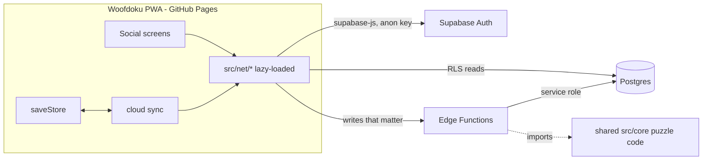

# Woofdoku Social — Plan (S1–S6)

> Status: **planned, not started.** Follows the meta roadmap in [doc 10](10-meta-roadmap.md).

## Problem

Woofdoku is a static, offline-first PWA on GitHub Pages, and all progress lives in `localStorage`. We parked these features earlier because they need a backend:

- leaderboards
- friends
- visiting friends' yards
- gifting
- challenges

This plan adds them on **Supabase** and keeps the game fully playable offline as a guest.

## Decisions (agreed)

- **Backend:** Supabase. It provides Postgres, Auth, row-level security (RLS), and Edge Functions written in TypeScript running on Deno. Its free tier fits our scale.
- **Accounts are optional:** the game works exactly as today without signing in. Social features ask you to sign in the first time you open them.
- **Sign-in:**
  - The first time you open a social feature, you get an **anonymous account**. No email is needed.
  - Linking a **magic-link email** later keeps the same account and allows recovery on other devices.
- **Cloud save sync is in scope**, so progress follows you between phone and desktop.

## Guiding principles

1. **Offline first.** Nothing in the core loop waits on the network, and social UI degrades to a friendly "offline" state.
2. **Opt-in and small.** The Supabase client is loaded only when needed (dynamic `import()`), so guests download nothing extra. If the env vars are missing, all social UI is hidden (a build-time feature flag).
3. **Kid-safe by design.**
   - No free-text chat and no search by name.
   - Friends connect only through a friend code or share link.
   - Interactions use preset reactions.
   - The only free text is the display name, and it is filtered.
4. **Server decides rewards.** Anything that grants items (gifts, pets) or ranks players is checked by an Edge Function, not by the client.
5. **Don't punish cheaters, just don't rank them.** Puzzles that can be verified get global boards. Unverifiable ones (Arcade) get friends-only boards.

## Architecture

- **Client code** lives in `src/net/`: `client.ts`, `auth.ts`, `sync.ts`, `scores.ts`, `friends.ts`, `social.ts`. The screens live in `src/ui/screens/social/`.
- **Server code** lives in `supabase/`, which holds `migrations/*.sql`, `functions/<name>/index.ts` and `seed.sql`.
- **Shared core:** the puzzle engine in `src/core` is pure TypeScript, so Edge Functions import it to regenerate Daily and Boss puzzles from their seed and check solutions. We may need a small bundling step if Deno cannot import it directly; the open questions cover this.
- **Config:**
  - `VITE_SUPABASE_URL` and `VITE_SUPABASE_ANON_KEY` are set in `deploy.yml` as repo variables. They are public by design and protected by RLS.
  - The service-role key exists only in function secrets and is never put in the repo.

## Data model (first draft)

| Table | Key columns | Who can read | Who can write |
| --- | --- | --- | --- |
| `profiles` | `id` (= auth uid), `display_name`, `friend_code` (unique, 8 chars), `avatar` (breed + outfit), `created_at`, `last_seen` | self + friends (public fields) | self (name goes through a filter function) |
| `saves` | `user_id`, `data` jsonb, `schema_version`, `progress_score`, `device`, `updated_at` | self | self |
| `scores` | `board`, `period` (e.g. `daily:2026-10-02`, `boss:2026-W40`, `arcade:pipes:hard`), `user_id`, `value`, `mistakes`, `verified`, `created_at`; unique(board, period, user) | everyone (verified boards), friends (arcade) | Edge Function only |
| `runs` | `id`, `user_id`, `board`, `period`, `started_at` | self | Edge Function only |
| `friendships` | `a`, `b`, `status` (pending/accepted/blocked), `requested_by`, `created_at` | both sides | Edge Function / self for accept, decline, remove |
| `yard_snapshots` | `user_id`, `pup` (name, breed, outfit, mood), `pack` (top 6 breeds), `decor` layout, `updated_at` | friends | self |
| `interactions` | `id`, `from`, `to`, `kind` (pet, gift, reaction, challenge), `payload`, `day`, `claimed_at` | sender + receiver | Edge Function only |
| `challenges` | `id`, `creator`, `seed`, `size`, `difficulty`, `expires_at` | anyone with the link | Edge Function only |
| `reports` | `reporter`, `target`, `reason`, `created_at` | nobody (admin) | self (insert) |

Every table has RLS enabled. Deleting an account cascades to all of the user's rows.

## Phases

### S1 — No-backend quick wins

These ship first because they need no server at all.

- **Daily share card:** after the Daily, a "Share" button copies or shares an emoji summary: date, time, mistakes, stars, streak, and a small grid of dog emoji. It uses the Web Share API with a clipboard fallback.
- **Challenge links:** an Endless or Daily-style puzzle link such as `?c=<seed>.<size>.<diff>.<timeMs>`. A friend who opens it plays the same puzzle and sees "Beat Alex's 1:42". The game parses and validates the link only on the client.
- **Yard photo** (from M8) gets "Share" next to the challenge link.

**Done when:** a player can share their Daily result and a challenge link, and opening a challenge link starts that puzzle with the target time shown.

### S2 — Foundations: Supabase, accounts and profile

- Create the Supabase project and the `supabase/` folder (migrations, config, CLI scripts in `package.json`).
- Add `src/net/client.ts`, which lazy-loads `@supabase/supabase-js`, and the `socialEnabled` feature flag.
- **Auth flow:**
  - The first time you open the 👥 Friends screen, you get an anonymous sign-in.
  - "Protect your account" links a magic-link email and keeps the same uid.
  - On a new device, "I already have an account" sends a magic link.
  - Sign out keeps local progress.
- **Profile:**
  - The display name is picked from generated suggestions ("Brave Beagle 42") or typed. Typed names are checked by a server-side word filter and length rules.
  - The avatar is your pup's breed plus outfit.
  - Each profile gets a unique friend code.
- **Privacy:**
  - A short privacy note in Settings.
  - "Delete my online account": deletes the server data but keeps the local save.
  - "Download my data": exports a JSON file.
- New 👥 **Friends** entry on the title screen. It shows a sign-in teaser when signed out and is hidden when the feature flag is off.

**Done when:** a player can sign in anonymously, set a name, link an email, sign in on a second device, and delete the account.

### S3 — Cloud save sync

- **Push:** debounced 5 s after save-store changes, plus on `visibilitychange: hidden`. The client upserts `saves` with `progress_score`, a simple number built from stars, levels, pack size and badges.
- **Pull:** when the app starts while signed in, and when you sign in on a new device.
- **Conflicts:**
  - If the cloud copy is newer and the local copy is unchanged since the last sync, use the cloud copy silently.
  - If both changed, show a **"Choose a save"** dialog that compares the two side by side (levels, ⭐, 🍖, pack, last played).
  - There is no automatic merge, because merging is too risky for idle timers and inventories.
  - Never silently replace a save that has more progress.
- **Device-only settings** (sound, music, haptics, reduced motion, contrast) are not synced.
- **Idle timers** (yard, expeditions) already use wall-clock timestamps, so they carry over as-is.
- **Offline:** changes queue up and push when the device is back online, with a sync status chip in Settings.

**Done when:** progress made on one device appears on another, and conflicting edits show the choose dialog. Unit tests cover the sync decision logic.

### S4 — Leaderboards

**Boards:**

| Board | Period | Ranking | Scope |
| --- | --- | --- | --- |
| 📅 Daily | per day | time, then mistakes | Global + Friends |
| 🏔️ Weekly Boss | per ISO week | time, then mistakes | Global + Friends |
| 🕹️ Arcade | per game × difficulty (all-time best) | game's best metric | Friends only |
| ⭐ Stars | all-time | total stars + badges | Friends only |

**Verification:**

- When a Daily or Boss puzzle starts, the client calls `start-run`, which returns a run id and records the server time.
- On a win, the client calls `submit-score` with the run id, the dog placements, the time and the mistakes.
- `submit-score` then:
  - regenerates the puzzle from `dailyConfig(date)` or `bossConfig(week)` using shared core code;
  - checks that the placements solve it;
  - checks that the claimed time is plausible: not lower than a size-based floor, and not more than server elapsed time + slack;
  - keeps only the player's best score per period.
- If the run started offline (no run id), the score is still accepted but marked unranked-pending. It shows on the Friends board, not the Global one.
- **Arcade:** scores are bounded by plausibility only and are friends-only, which removes the incentive to cheat.

**UI:**

- A 🏆 Leaderboards screen with Daily, Boss and Arcade tabs and a Global / Friends toggle.
- Shows the top 50 plus "your rank".
- The win screen shows "You're #12 today · 3rd among friends".

**Done when:** Daily and Boss scores are verified and ranked globally and among friends, with function tests covering valid, wrong and too-fast submissions.

### S5 — Friends and visiting yards

**Adding friends:**

- Enter a friend code, or open a shared invite link `?friend=CODE`. The link opens a confirmation.
- Requests can be accepted, declined, removed or blocked.
- A friend limit (e.g. 100) and rate limits on requests.

**Friends list:** each row shows the avatar pup, name, level reached, streak and last active ("today", "this week").

**Yard snapshot:**

- Published on sync and readable by friends only.
- **Visit** opens a read-only Yard showing their pup, pack, decor and mood.

**Preset interactions** (no free text):

- 🐾 **Pet their pup:** once per friend per day. Their pup gets a small mood boost and you both get +2 🥣. Capped at 10 received per day.
- 🎁 **Gift:** once per friend per day. It does not cost the sender; the receiver gets 15 🍖, claimable from an inbox. Capped at 5 claims per day. Server-side caps stop farming with alt accounts.
- 💬 **Reactions:** a preset sticker on their yard (❤️ 😂 😮 👏 🌟 🐶). It shows as a small bubble on their next visit.

**Inbox:** a 📬 badge on the Friends button lists pets, gifts and reactions with "Claim all".

**Safety:** block hides you both ways and removes the friendship. Report sends the user and reason to `reports` for manual review.

**Done when:** two accounts can befriend each other, visit each other's yards, pet, gift and react, with caps enforced on the server.

### S6 — Friend challenges and weekly recap

- **Server challenges** upgrade the S1 links. "Challenge friends" on a puzzle creates a `challenges` row (seed, size, difficulty, expires in 7 days). Friends see it in their inbox, and the result list shows everyone's time. Times are verified like Daily scores.
- **Weekly friends recap:** a Monday card with:
  - this week's top friend on the Boss and the Daily;
  - who you petted most;
  - your rank change.
  It is computed on demand from the existing tables, so no cron job is needed.
- **New badges:**
  - **Good Neighbour:** pet friends' pups.
  - **Gift Giver:** send gifts.
  - **Challenger:** win friend challenges.
  - **Top Dog:** finish #1 among friends on a weekly Boss.
  Each badge has a bronze/silver/gold reward in line with the existing badge system.

**Done when:** players can challenge friends to the same puzzle and compare verified times, and the recap and badges work.

## Testing

- **Unit (vitest):**
  - sync decision logic
  - progress score
  - challenge link encoding and decoding
  - display-name rules
  - interaction caps (pure functions shared with the Edge Functions)
- **Edge Functions:** Deno tests for `submit-score` (valid, wrong solution, too fast, duplicate, better score), `send-interaction` (caps, blocked users) and `friend-request`.
- **Database:** RLS checks run against a local Supabase (`supabase start`). Each one checks that a user cannot read strangers' saves or snapshots and cannot write scores directly.
- **E2E (Playwright):**
  - Network is mocked with `page.route` for social screens.
  - The whole suite also runs with social disabled, so offline guests are not affected.
  - Optional: a nightly job against a local Supabase.

## Operations and cost

- The free tier should cover early use: tables are small and scores are one row per player per period.
- Old Daily rows are pruned after 90 days by a scheduled SQL job, or kept if the volume stays small.
- Rate limits live in the Edge Functions (per uid and per IP).
- Monitoring uses the Supabase dashboard and logs. Abuse handling is a manual review of the `reports` table for now.

## Risks and open questions

- **Shared core in Deno:** if Edge Functions cannot import `src/core` directly, we add a small build step that bundles a `verify` module (esbuild) into `supabase/functions/_shared/`.
- **Puzzle generation cost on the server:** the Boss is a 10×10 seeded puzzle. We need to confirm that generation stays under the Edge Function CPU limit, or cache each period's solution in a `puzzles` table the first time it is verified.
- **Magic-link email** via Supabase's built-in SMTP has low sending limits. Before launch we may need a custom SMTP provider such as Resend.
- **GDPR and under-13 players:** collect no personal data beyond an optional email, offer account deletion, and include the privacy note. A full age-gate is not planned.
- **Save schema changes:** `schema_version` lets older clients refuse a newer cloud save instead of corrupting it ("Update the app to load this save").

## Todos

1. `s1-share-cards`: Daily share card plus challenge links (no backend).
2. `s2-foundations`: Supabase project, `supabase/` folder, lazy client, feature flag, env config.
3. `s2-auth-profile`: anonymous sign-in, magic-link upgrade, profile, friend code, delete/export.
4. `s3-cloud-sync`: push/pull, conflict dialog, offline queue.
5. `s4-verify-shared`: shared verification module for the Edge Functions.
6. `s4-leaderboards`: `start-run` and `submit-score` functions, scores table, leaderboard UI.
7. `s5-friends`: friend codes, invite links, requests, list, block/report.
8. `s5-yard-visits`: yard snapshots, read-only visit, pets, gifts, reactions, inbox.
9. `s6-challenges-recap`: server challenges, weekly recap, social badges.
10. `social-tests-docs`: RLS/function/e2e tests, docs and README updates per phase.
